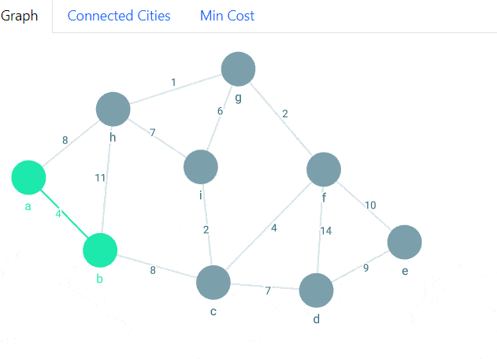

# Graph Algo Exploration

The project aims to develop interactive visualizations for a set of algorithms, coupled with references to relevant problems and test sets. Must-have algorithms include visualizations from algorithm such as Kruskal's Algorithm, Prim's Algorithm, A* Search, Adversarial Search and Pruning, and Minimum Spanning Tree. Problems references to relevant problems and test sets will be included for each algorithm. Optionally the student will attempt into developing
visualizations for: Fleury's Algorithm, Connected Components, Topological Sort, Floyd Warshall, Greedy Algorithm, Heapify, and Bellman Ford Algorithm.

**Mandatory**


**Minimum Spanning Trees**
- [x] Kruskal's Algorthm
- [x] Prim's Algorithm
- [x] Adversarial Search and Prunning


**Additional**

- [ ] Fleury's Algorithm
- [ ] Connected Components
- [ ] Topological Sort
- [ ] Floyd Warshall
- [ ] Greedy Algorithm
- [ ] Heapify
- [ ] Bellman Ford Algorithm.

## Illustrated Problems:

- [x] Minimal Spanning Tree
  - [x] Prims
  - [x] Kruskal
- [ ] Find Best Path


### Minimal Spanning Tree


- Allows Resetting
- Stepping
- Looping Animations

### Prim's Algorithm




## Resources:

Introduction to Algorithms, 4rth Edition, Cormen, Leiserson, Rivest, Stein

[Graph Algorithms for Data Science](https://www.manning.com/books/graph-algorithms-for-data-science)
- Graphss and Network Science
- Representing Network Structure
- Exploratory Graph Analysis
- Introduction to Social Network Analysis
- Projecting Monopartitie Networks
- Inferring Co-Occurence Networks Based on Bipartitie Netowkrs
- Constructing Nearest Neighbor Similarity Network
- Node Embeeddings And Classification
- Link Prediction

[Graph Machine Learning](https://www.packtpub.com/product/graph-machine-learning/9781800204492)
- Machine Learning on Graphs
- Unsupervised Learning on Graphs
- Problems with Machine Learning on Graphs
- Social Network Graphs
- Text Analytics and Natural Language Using Graphs
- Graph Analysis for Credit Card Transactions
- Building  a Data Driven Powered Application.

[Basic Graph Theory](https://www.amazon.com/Theory-Undergraduate-Topics-Computer-Science/dp/3319494740?asin=3319494740&revisionId=&format=4&depth=1)

- Paths, Cycles and Connectivity
- Matching and Covering
- Planar Graphs
- Graph Coloring
- Diagraphs
- Special Cases of Graphs

[AI For Games](https://www.amazon.com/AI-Games-Third-Ian-Millington/dp/1138483974/ref=sims_dp_d_dex_ai_speed_loc_mtl_v4_d_sccl_2_3/133-4588073-5551926?pd_rd_w=RPvI8&content-id=amzn1.sym.f8b81522-706a-46d3-a585-5fc6e1682ebe&pf_rd_p=f8b81522-706a-46d3-a585-5fc6e1682ebe&pf_rd_r=YS8NPV1FX5BVV9YQTVPE&pd_rd_wg=4xiIc&pd_rd_r=9845e2de-70b5-429d-ad02-68db730f5af8&pd_rd_i=1138483974&psc=1)
- 


## Current Features


## Deployment

```
$ npm install gh-pages --save-dev
$ git remote add origin https://github.com/nenewang/graph-algo-exploration.git
```


## Backlog

- [ ] Add Prism Algorithm for visualization
- [ ] Draw Analogies 
- [ ] Add A* Search for visualization
- [ ] Add Adversarial Search and Pruning for visualization


